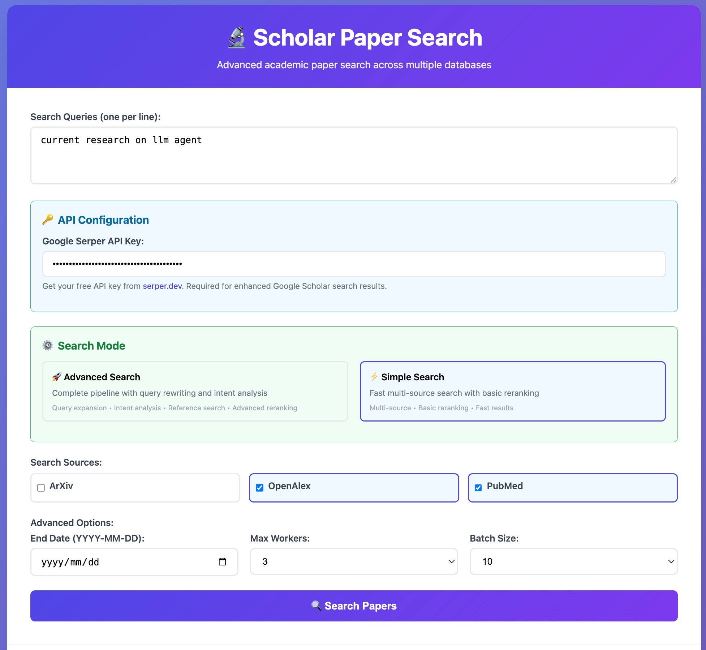
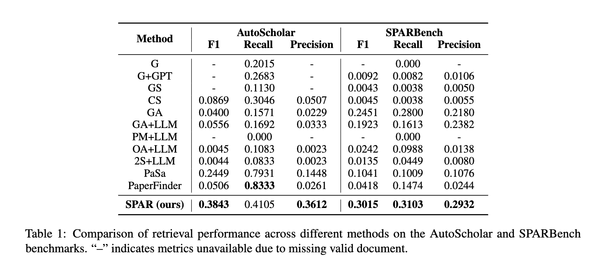

# SPAR: Scholar Paper Retrieval with LLM-based Agents for Enhanced Academic Search

Paper URL: https://arxiv.org/abs/2507.15245
Dataset URL: [Coming Soon]

An intelligent academic paper retrieval system based on Large Language Model (LLM) agents, providing search, retrieval, and re-ranking capabilities.


## 🚀 Quick Start

### Requirements

```bash
pip install -r requirements.txt
```

### Basic Configuration

1. **Configure API Keys**
   - Edit [`global_config.py`](global_config.py) to set GPT-related keys and search parameters
   - For local models, refer to [`local_request_v2.py`](local_request_v2.py) to configure `MODEL_CONFIGS`

2. **Launch Web Interface**
   ```bash
   python3 demo_app_with_front.py
   ```
   

   search result details can be found: [here](./figs/search_results_2025-07-22.json)

3. **Use Service Interface**
   ```bash
   python3 run_spr_agent.py $benchname
   ```
   Supported `benchname`: `OwnBenchmark` | `AutoScholarQuery`

##  Project Structure

| File | Description |
|------|-------------|
| [`search_engine.py`](search_engine.py) |  Main entry point for retrieval system |
| [`pipeline_spar.py`](pipeline_spar.py) |  Complete SPAR processing pipeline |
| [`search_node.py`](search_node.py) |  Specific functionality implementation for pipeline |
| [`rerank.py`](rerank.py) |  Result re-ranking module |
| [`global_config.py`](global_config.py) |  Global configuration file |
| [`demo_app_with_front.py`](demo_app_with_front.py) | Visual frontend application |

## 🔧 Advanced Configuration

### Local Database Acceleration (Optional)

Download local cache database to improve query speed:

```bash
# Download database file
mkdir -p database
wget "http://flagchat.ks3-cn-beijing.ksyuncs.com/shixiaofeng/project/SPAR/arxiv_data.db?KSSAccessKeyId=AKLTkqVnZwpfTBiiu7O6iQHnA&Expires=7753081204&Signature=gaj8%2F5rJ%2BUQWp6wSr0f5KKuJdqs%3D" -O database/arxiv_data.db
```

### Graphical Visualization (Optional)

Install Graphviz to generate tree diagrams of the retrieval process:

```bash
# Ubuntu/Debian
sudo apt-get install graphviz
pip install graphviz

# macOS
brew install graphviz
pip install graphviz

# Windows
# 1. Download and install Graphviz: https://graphviz.org/download/
# 2. pip install graphviz
```

Preview:


## 📈 Experimental Results



##  Output Description

- Retrieval results saved to: `./figs/search_results_2025-07-22.json`
- Visualization charts saved in `./figs/` directory

##  Features

### 🎯 Advanced Search Mode
- **Query Rewriting**: Automatic query expansion and refinement
- **Intent Analysis**: Understanding search intent for better results
- **Reference Search**: Follow citation networks for comprehensive coverage
- **Advanced Re-ranking**: Multi-layer relevance scoring

### ⚡ Simple Search Mode
- **Multi-source Search**: ArXiv, OpenAlex, PubMed integration
- **Basic Re-ranking**: Fast relevance scoring
- **Batch Processing**: Efficient parallel processing

### 🎨 Web Interface
- **Interactive UI**: User-friendly search interface
- **Real-time Results**: Live search progress and results
- **Export Options**: JSON export for further analysis
- **Search Tree Visualization**: Visual representation of search process

## 📖 Citation

If you use the SPAR system, please cite our work:

```bibtex
@misc{shi2025sparscholarpaperretrieval,
      title={SPAR: Scholar Paper Retrieval with LLM-based Agents for Enhanced Academic Search},
      author={Xiaofeng Shi and Yuduo Li and Qian Kou and Longbin Yu and Jinxin Xie and Hua Zhou},
      year={2025},
      eprint={2507.15245},
      archivePrefix={arXiv},
      primaryClass={cs.IR},
      url={https://arxiv.org/abs/2507.15245},
}
```

## 📄 License

This project is licensed under the [MIT License](LICENSE).

## 🤝 Contributing

Issues and Pull Requests are welcome to help improve the SPAR system!

##  Troubleshooting

### Common Issues

1. **API Quota Exceeded**: Ensure you have sufficient API quota for LLM calls
2. **Slow Performance**: Consider using local database acceleration
3. **Network Issues**: Check network connectivity for external API calls

### Performance Tips

- Test on small datasets first to evaluate system performance
- Use local models when possible to reduce API costs
- Enable database caching for frequently accessed papers

---

> **Note**: Ensure you have sufficient API quota for Large Language Model calls. It's recommended to test the system performance on small-scale data first.