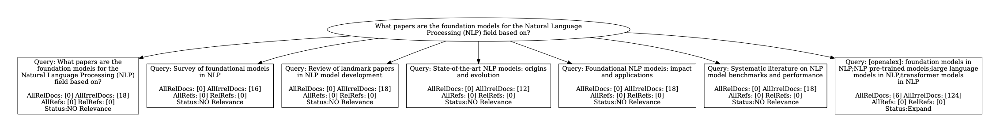
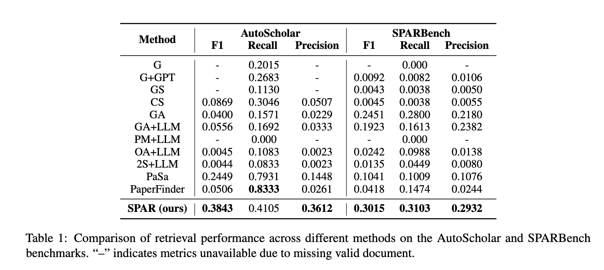

# SPAR: Scholar Paper Retrieval with LLM-based Agents for Enhanced Academic Search

[](https://arxiv.org/abs/2507.15245)
[](https://huggingface.co/datasets/XiaofengAlg/SPARBench)
[](LICENSE)
[](CITATION.cff)

[English](README.md)

SPAR 是一个多 Agent 学术检索框架，结合 RefChain 查询拆解、查询演化、引文感知探索与重排序。配套的 **SPARBench** 提供专家标注的相关性标签，用于系统化评测。

> 如果使用 SPAR 或 SPARBench，请引用
> [SPAR 论文](https://arxiv.org/abs/2507.15245)。机器可读引用信息见
> [CITATION.cff](CITATION.cff)。



## 🚀 快速开始

### 环境要求

```bash
pip install -r requirements.txt
```

### 基本配置

1. **配置 API 密钥**
   - 通过 `OPENAI_API_KEY`、`GOOGLE_SERPER_KEY` 和可选的 `S2_API_KEY`
     环境变量提供服务凭据，请勿提交 API 密钥
   - 编辑 [`global_config.py`](global_config.py)，设置非敏感搜索参数
   - 如使用本地模型，参考 [`local_request_v2.py`](local_request_v2.py) 配置 `MODEL_CONFIGS`

2. **启动可视化界面**
   ```bash
   python3 demo_app_with_front.py
   ```
   

3. **使用服务接口**
   ```bash
   python3 run_spr_agent.py $benchname
   ```
   支持的 `benchname`: `OwnBenchmark` | `AutoScholarQuery`

## 项目结构

| 文件 | 功能描述 |
|------|----------|
| [`search_engine.py`](search_engine.py) | 检索系统主入口 |
| [`pipeline_spar.py`](pipeline_spar.py) |  SPAR 完整处理流水线 |
| [`search_node.py`](search_node.py) |  流水线具体功能实现 |
| [`rerank.py`](rerank.py) |  结果重排序模块 |
| [`global_config.py`](global_config.py) | 全局配置文件 |
| [`demo_app_with_front.py`](demo_app_with_front.py) | 可视化前端应用 |

## 🔧 高级配置

### 本地数据库加速（可选）

下载本地缓存数据库以提升查询速度：

```bash
# 下载数据库文件
mkdir -p database
wget "http://flagchat.ks3-cn-beijing.ksyuncs.com/shixiaofeng/project/SPAR/arxiv_data.db?KSSAccessKeyId=AKLTkqVnZwpfTBiiu7O6iQHnA&Expires=7753081204&Signature=gaj8%2F5rJ%2BUQWp6wSr0f5KKuJdqs%3D" -O database/arxiv_data.db
```


### 图形化可视化（可选）

安装 Graphviz 以生成检索过程的树状图：

```bash
# Ubuntu/Debian
sudo apt-get install graphviz
pip install graphviz

# macOS
brew install graphviz
pip install graphviz

# Windows
# 1. 下载安装 Graphviz: https://graphviz.org/download/
# 2. pip install graphviz
```

效果预览：


## 📈 实验结果



## 输出说明

- 检索结果保存路径: `./figs/search_results_2025-07-22.json`
- 可视化图表保存在 `./figs/` 目录

## 引用

如果您使用了 SPAR 系统，请引用我们的工作：

```bibtex
@misc{shi2025sparscholarpaperretrieval,
      title={SPAR: Scholar Paper Retrieval with LLM-based Agents for Enhanced Academic Search},
      author={Xiaofeng Shi and Yuduo Li and Qian Kou and Longbin Yu and Jinxin Xie and Hua Zhou},
      year={2025},
      eprint={2507.15245},
      archivePrefix={arXiv},
      primaryClass={cs.IR},
      url={https://arxiv.org/abs/2507.15245},
}
```

## 📄 许可证

本项目采用 [MIT License](LICENSE) 开源协议。

## 🤝 贡献

欢迎提交 Issue 和 Pull Request 来帮助改进 SPAR 系统！

---

> **注意**: 确保您有足够的 API 配额用于大语言模型调用，建议先在小规模数据上测试系统性能。
